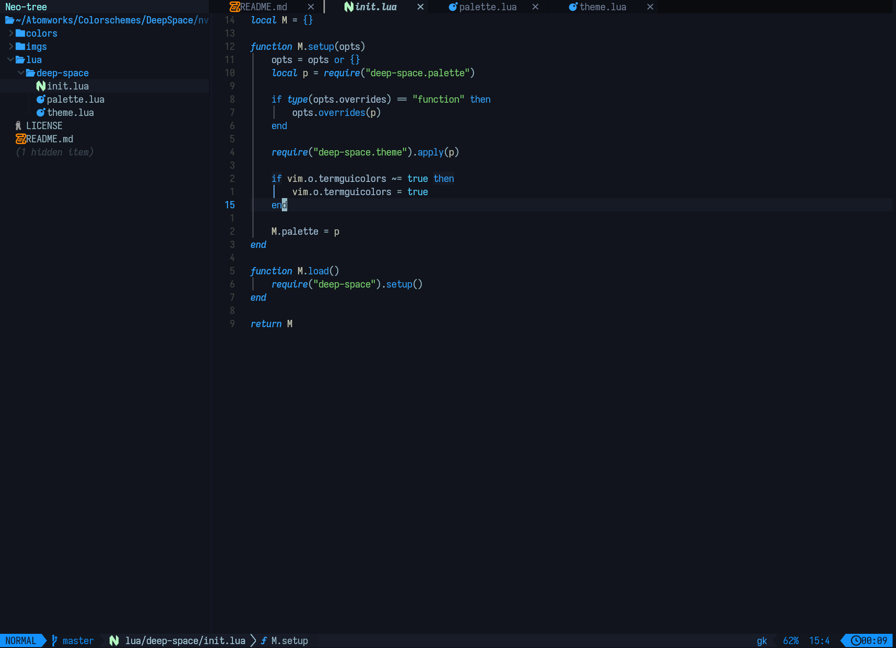

# Deep Space theme

Simple Neovim theme. Works OK with most of lazyvim default plugins. 

## Installation

Just use your favorite plugin manager, for example with lazy nvim:

```lua
 {"pbatomic/deep-space.nvim"}
```

## Screenshot


